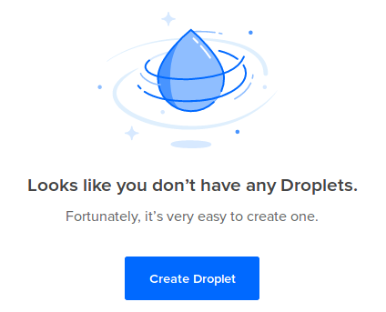
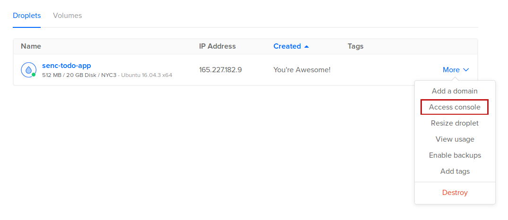

# Digital Ocean
Siga as instruções para reinvidicar seu pacote de estudantes do Github em:

https://education.github.com/

O pacote de estudante lhe dará 50 dólares para gastar no [Digital Ocean](https://www.digitalocean.com/). Crie sua conta, e clique em "Create a droplet"



(Lembre de criar um droplet de 5 dolares por mês)

Após isso, você poderá ver o IP do droplet na pagina do digital ocean. A senha de administrador será enviada para seu email.

Acesse o droplet utilizando o comando ssh:
```
ssh root@<ip do droplet>
```
Ou utilizando o access console no site do digital ocean caso não tenha linux em casa:


(Usuário root, use a senha do email)

# Dependências
Instale as dependências do projeto:
```
apt-get update
apt-get install python3 python3-dev virtualenv mongodb nginx gcc

curl -sL https://deb.nodesource.com/setup_8.x | sudo -E bash -
apt-get install nodejs
```

Baixe o projeto deste github:
```
git clone https://github.com/gperinazzo/senc_todo_app
cd senc_todo_app
```
(O projeto deve estar em `/root/senc_todo_app`)

O Digital Ocean tenta indentificar o local de onde quem criou o droplet é, e isso gera alguns problemas de configuração. Para evitar erros, execute o seguinte comando:
```
locale-gen en_US.UTF-8
export LC_ALL="en_US.UTF-8"
```


#Instalando o projeto

Inicialmente, vamos instalar as dependências de python:
```
cd api
virtualenv -p python3 env
source env/bin/activate
pip install -r requirements.txt
```
Alem das dependências que vimos no minicurso, será instalado tambem o `uWSGI`, que funciona como um servidor intermediario para a aplicação flask se comunicar com o webserver `nginx`.

Após isso, vamos criar os arquivos finais da interface:
```
cd ../ui
npm install
npm run build
chown -R www-data:www-data build
mv build /
cd ..
```
Esse comando irá gerar o bundle de javascript final de nossa aplicação (o Rogerio deu uma melhorada nele :) )

Para que o servidor da API rode como um serviço, podemos usar o [systemd](https://www.freedesktop.org/wiki/Software/systemd/), um gerenciador de serviços do linux. Nós criamos o arquivo de inicialização dele com o seguinte conteúdo:
```
[Unit]
Description=uWSGI Emperor
After=syslog.target

[Service]
ExecStart=/root/senc_todo_app/api/env/bin/uwsgi --ini /root/senc_todo_app/api/uwsgi.ini --lazy-apps
RuntimeDirectory=/root/senc_todo_app/api
Restart=always
KillSignal=SIGQUIT
Type=notify
StandardError=syslog
NotifyAccess=all

[Install]
WantedBy=multi-user.target

```
É necessario mover o arquivo para o local correto e iniciar o serviço:
```
mv todo.service /etc/systemd/system/
systemctl enable todo.service
systemctl start todo.service
```
Por ultimo, o seguinte arquivo de configuração para o nginx foi criado:
```
server {
	listen 80 default_server;

	location /users {
		include uwsgi_params;
		uwsgi_pass unix:///api_server.sock;
	}

	location /tasks {
		include uwsgi_params;
		uwsgi_pass unix:///api_server.sock;
	}

	location / {
		root /root/senc_todo_app/ui/build;
	}
}

```
Esse arquivo diz para o nginx redirecionar qualquer rota com `/users` ou `/tasks` para nosso servidor em python, e em outras rotas servir arquivos criados pelo frontend. Mova a configuração para a pasta certa e reinicie o nginx:
```
mv nginx.conf /etc/nginx/conf.d/
rm /etc/nginx/sites-enabled/default
systemctl restart nginx.service
```

E pronto, seu projeto está disponivel no servidor (acesse colocando o IP do servidor no navegador). O meu está em [http://165.227.182.9]


Qualquer duvida, estamos disponíveis em:
- perinazzo@raccoon.ag
- rogerio@raccoon.ag
